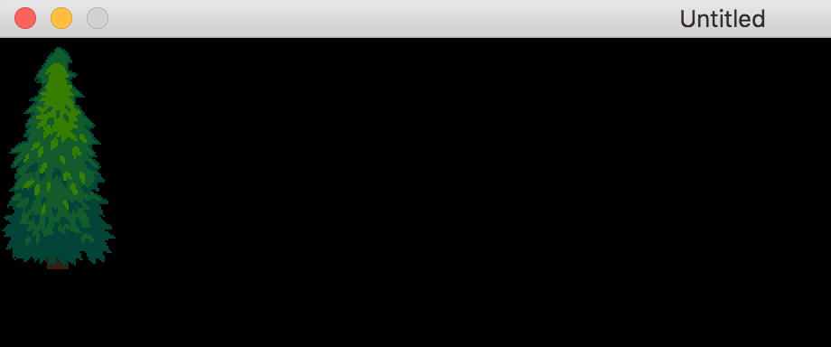

# STI Procedural Generation Example

This repository provides an example of procedurally-generating Tiled-format maps in the Lua (`.lua`) format. My aim is to demystify the Tiled format and to encourage the use of STI by those doing procedural generation (for instance, generating random maps for roguelike games or sandbox/open world games). This code depends on the ability to pass a map table into STI directly, which was added in `v0.16.0.4`.

The lua map tables generated will probably work with most Lua frameworks, but I've only tested with the STI ([Simple Tiled Implementation](https://github.com/karai17/Simple-Tiled-Implementation)) library, which is the most popular Tiled library for [the LÖVE framework](https://love2d.org/).

## Creating the map table

The first step is to create a table for your overall map:

```lua
-- create a new orthogonal map that is 64x64 tiles, each tile is 32x32 pixels
local map = {
  orientation = "orthogonal",
  width = 64,
  height = 64,
  tilewidth = 32,
  tileheight = 32,
  tilesets = {},
  layers = {}
}
```

I set the orientation to `orthogonal`, which is the default (a typical top-down view). The other options are isometric and hexagonal, I'm not sure if those are the exact strings but I would guess that they are (warning: I haven't used isometric or hexagonal maps before, so I don't know if they will work well with the standard x,y coordinate system I'm using in the helper functions below).

Also notice that I created placeholders for tilesets and layers and setup the dimensions of the map (in "tile" units -- the number of tiles across & number of tiles high) as well as the dimensions of each individual tile (in pixels).

## Creating a tileset

In order for a map to have graphics to display, we need to add a tileset. This is based on a single image, usually a PNG, that has the images for each type of tile in it:

```lua
-- create a tileset from an image (Liberated Pixel Cup terrain_atlas.png from opengameart.org)
local tileset = {
  name = "terrain_atlas",
  firstgid = 1,
  tilewidth = 32,
  tileheight = 32,
  spacing = 0,
  margin = 0,
  image = "assets/terrain_atlas.png",
  imagewidth = 1024,
  imageheight = 1024,
  tileoffset = {x = 0, y = 0},
  tilecount = 1024,
  tiles = {}
}
table.insert(map.tilesets, tileset)
```

You'll notice I'm using a 32x32 tileset from the (excellent) [Liberated Pixel Cup](http://lpc.opengameart.org/) that I found on opengameart.org (search for "LPC" and you'll find a lot of compatible 32x32 open-source art).

The `tilecount` in my example just happens to match the `imagewidth` and `imageheight`, but that's a coincidence due to the fact that my tiles are 32x32 pixels and the tilesheet happens to be 32 tiles x 32 tiles.

Aside: in the Tiled format, I think the `spacing` and `margin` values are not completely independent of each-other. I could be wrong, but I think I recall being surprised that one includes the other.

## Creating a layer of your map

Tiled maps are made up of layers, which are drawn in order. For this example, we'll just create one layer (later we'll draw a tree on it):

```lua
-- create a layer of the map, with the same height/width as the map
local layer = {
  type = "tilelayer",
  name = "",
  x = 0,
  y = 0,
  width = 64,
  height = 64,
  visible = true,
  opacity = 1,
  offsetx = 0,
  offsety = 0,
  properties = {},
  encoding = "lua",
  data = {}
}
table.insert(map.layers, layer)
```

I didn't provide a name for my layer, but you may want to do that. All the data here is pretty much boilerplate -- matching the map data. If you're making a lot of layers, you'll probably want to write a function that auto-generates this for you.

## Pre-populating the layer with empty tiles

In the Tiled format a `0` represents an empty tile. The format seems to require that the entire layer be populated, so in some cases it's easiest to just pre-populate the whole layer with empty tiles:

```lua
-- populate the layer with empty tiles
function populateLayer(layer)
  for i=1, layer.width * layer.height do
    table.insert(layer.data, 0)
  end
end

populateLayer(layer)
```

 The thing that makes this a little tricky is that the Tiled format stores the layer data in a flat 1-dimensional array instead of a 2-dimensional array with x and y coordinates. So instead of looping through an `x` variable from 1 to the width and a `y` variable from 1 to the height, we just need a single index that runs from 1 to the total number of tiles (`width * height`).

## Draw a tree in the layer

 In the LPC tilesheet, there is a tree from the top-left coordinate of (30, 0) to the bottom-right coordinate of (31, 3), assuming a coordinate system that starts at (0, 0). Here, we add each of the 8 tree tiles to the layer:

```lua
-- helper function to set a tile in the layer based on x,y coordinates
function setTile(layer, x, y, tile_id)
  layer.data[x + y * layer.width + 1] = tile_id -- +1 because 0 is reserved in Tiled for no-tile
end

-- helper function to get the ID of a tile from the tileset using x,y coordinates
function getTileID(tileset, x, y)
  local width = tileset.imagewidth / tileset.tilewidth
  return x + y * width + 1 -- +1 because 0 is reserved in Tiled for no-tile
end

setTile(layer, 0, 0, getTileID(tileset, 30, 0))
setTile(layer, 1, 0, getTileID(tileset, 31, 0))
setTile(layer, 0, 1, getTileID(tileset, 30, 1))
setTile(layer, 1, 1, getTileID(tileset, 31, 1))
setTile(layer, 0, 2, getTileID(tileset, 30, 2))
setTile(layer, 1, 2, getTileID(tileset, 31, 2))
setTile(layer, 0, 3, getTileID(tileset, 30, 3))
setTile(layer, 1, 3, getTileID(tileset, 31, 3))
```

This is where things get a little complicated. I find it much easier to work in (x,y) coordinate space, but the Tiled format prefers flat arrays (they are more compact and more performant). So instead of being referenced by x,y, Tiled uses an incrementing TileID which can be calculated by adding the `x` coordinate to the number of tiles in the above rows and adding 1. The reason we have to add `1` is because Tiled reserves `0` for the empty tile.

Once we have the TileID, we need to set the tile into the layer, but again, we have to convert from our desired x,y coordinates to Tiled's 1-dimensional array index, which the `setTile()` helper function does for us.

Now, after we add in the typical LÖVE and STI boilerplate (you can see this in the main.lua file), we can see our tree:



## Afterword

I hope the above example made the Tiled Lua format clearer and more approachable. While it is certainly possible to ignore this format and the STI library and to instead create your own table format for procedurally-generated terrain, there are advantages to using the STI library, since has become a bit of a standard in the LÖVE community and many libraries, tutorials and example code use it or interoperate well with it.
